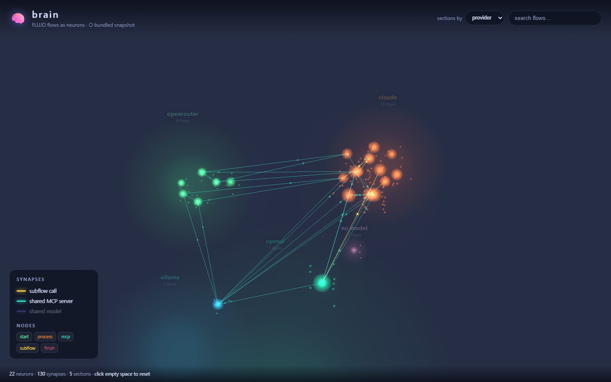

# 🧠 brain

**A WebGL brain that renders [FLUJO](https://github.com/mario-andreschak/FLUJO) flows as neurons — and their relationships as synapses.**

Every FLUJO flow becomes a glowing **neuron**. The connections *between* flows become **synapses** with signals pulsing along them, so a whole FLUJO workspace reads at a glance as a living neural network.



## What you're looking at

Each neuron is one flow. Its **size** scales with how many nodes the flow has, and its **colour** is the model provider it leans on:

| colour | provider |
| --- | --- |
| 🟠 amber | Claude (subscription / Anthropic) |
| 🟢 green | OpenRouter |
| 🔵 cyan | Ollama (local) |
| 🟣 violet | Gemini / Google |
| 🩶 grey | dormant flow (nodes but no wiring) |

Neurons are wired by three kinds of **synapse**, each derived from the real flow definitions:

| synapse | meaning |
| --- | --- |
| 🟡 **subflow call** | one flow runs another as a Subflow node — a directed axon, always pulsing source → target |
| 🟦 **shared MCP server** | two flows bind the same MCP server (shared tooling) |
| 🟪 **shared model** | two flows use the same model |

## Sections (galaxies)

Flows are organised into spatially separated **brain sections** — galaxies — each with its own hue, faint nebula, and floating label. Pick how they group from the **`sections by`** dropdown:

- **provider** — one galaxy per model provider (Claude, OpenRouter, Ollama, …)
- **folder** — one galaxy per FLUJO dashboard folder
- **model** — one galaxy per model

A two-level force layout places the galaxy centres apart, then lays out each flow within its galaxy — subflow ties pull hardest, cross-galaxy ties barely pull, so the sections stay distinct while shared-resource synapses still stretch between them.

Within a galaxy each flow is a bright **core star** (sized by node count) surrounded by faint satellite stars — its own internal nodes (`start`/`process`/`mcp`/`subflow`/`finish`).

## Interacting

- **Drag** to orbit, **scroll** to zoom (the brain gently auto-rotates until you touch it).
- **Hover** a neuron to see its name and light up its immediate connections.
- **Click** a neuron to zoom into it: the camera flies in, the flow's internal nodes get labels (start / process / mcp / subflow / finish) and wiring, and the side panel shows its MCP servers and connections in collapsible groups.
- **`sections by`** dropdown regroups the whole brain by provider / folder / model.
- **Search** to spotlight flows by name.
- **Deep link** with `?focus=<flow name>` to open the brain zoomed into a flow.
- Toggle any **synapse type** in the legend.
- Click empty space to reset.

## Data: live or snapshot

On load, `brain` first tries a **running FLUJO instance** at `http://localhost:4200` (`GET /api/flow`, `/api/model`, `/api/mcp/servers` + per-server status). If FLUJO isn't running — or the request is blocked cross-origin — it falls back to a **bundled snapshot** generated from your local FLUJO database. The source badge at the top shows which one is active.

**Live refresh:** the brain polls FLUJO every few seconds and rebuilds itself when anything changes — new or edited flows, newly installed MCP servers, or a server's connection state flipping. A snapshot also upgrades itself to live automatically the moment FLUJO becomes reachable.

**MCP server state:** every MCP server a flow binds is shown with a status dot — 🟢 connected, 🔴 disconnected, ⚪ disabled (live only; a snapshot shows `unknown`). Satellite stars of `mcp` nodes whose server is down or disabled break from their galaxy's hue so problems are visible from orbit.

Both paths run the exact same distillation logic ([`src/data/distill.ts`](src/data/distill.ts)), so the picture is identical either way.

### Regenerating the snapshot

```bash
npm run gen
```

This reads your FLUJO `db/` directory and writes `public/data/flows.json`. It looks for the db in this order:

1. `$FLUJO_DB` — explicit path to a `db` folder
2. `$FLUJO_HOME/db`
3. common locations (`~/Documents/GitHub/FLUJO/db`, `~/FLUJO/db`, `~/.flujo/db`, `../FLUJO/db`)

```bash
FLUJO_DB=/path/to/FLUJO/db npm run gen
```

## Develop

```bash
npm install
npm run dev      # vite dev server
npm run build    # regenerate snapshot, typecheck, and build to dist/
npm run preview  # serve the production build
```

Built with [Three.js](https://threejs.org/), TypeScript, and Vite. No backend — it's a static site (deployable to GitHub Pages; `vite.config.ts` defaults to a relative base).

## How it maps FLUJO → brain

FLUJO flows are graphs of typed nodes (`start`, `process`, `mcp`, `subflow`, `finish`) connected by edges. `brain` distils each flow into a neuron, reading:

- **process** nodes → the models/providers the flow uses (`boundModel`)
- **mcp** nodes → the MCP servers it binds (`boundServer`)
- **subflow** nodes → the flows it calls (`subflowId`)

…then wires neuron-to-neuron synapses from the shared/called resources. See [`src/types.ts`](src/types.ts) for the full model.

## License

MIT
