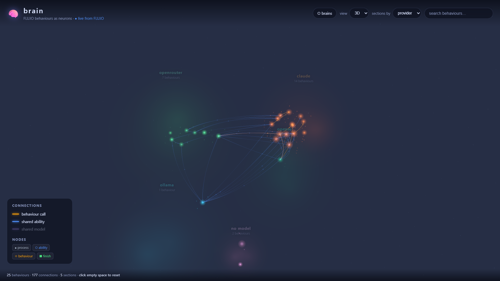
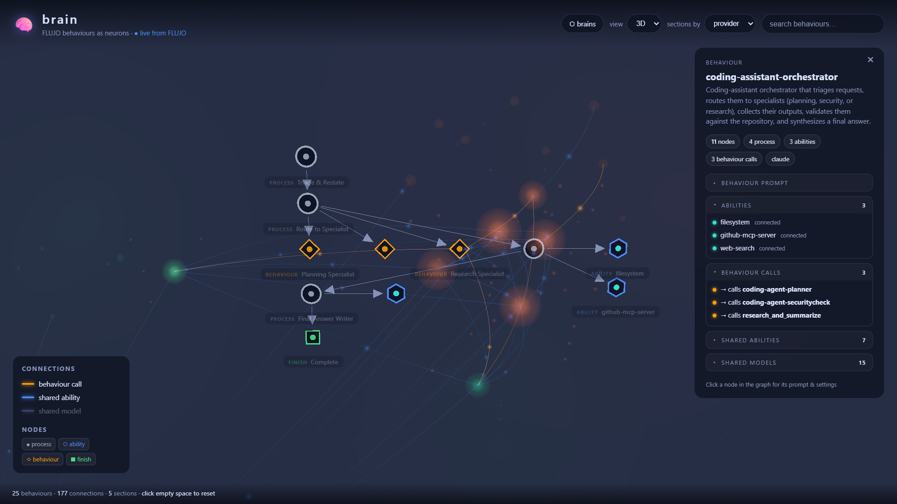
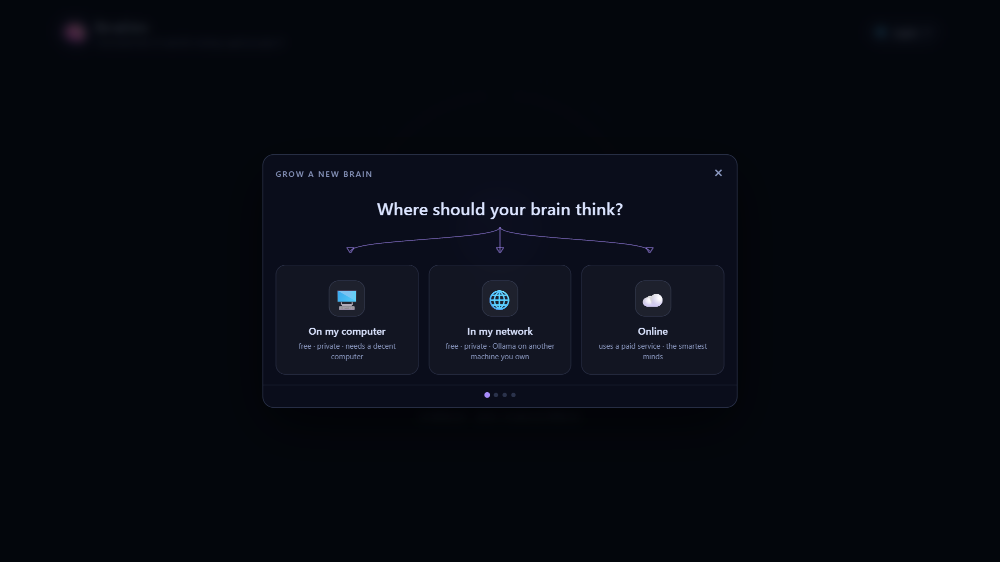

<div align="center">

# 🧠 brain

### Your AI agents have a brain. Now you can *watch it think.*

**brain** turns a [FLUJO](https://mario-andreschak.github.io/FLUJO/githubpages/index.html) workspace into a living neural network —
every flow a glowing neuron, every connection a synapse with signals pulsing along it.
Then it goes further: it **grows autonomous brains** that learn, act, and evolve on their own,
while you watch every thought fire in real time.

[](#-one-command-to-life)
[](https://threejs.org/)
[](tsconfig.json)
[](#license)



*A real FLUJO workspace, live: 25 behaviours, 177 connections, organised into provider galaxies.*

</div>

---

## ✨ What is this?

Agent workflows are graphs. Graphs are boring rectangles on a canvas — until you realise what they actually are: **behaviours wired into a mind.**

**brain** renders that mind. It connects to a running FLUJO instance and builds a 3D universe out of it:

- 🌟 Every flow becomes a **neuron** — sized by complexity, coloured by the model provider it thinks with
- ⚡ Subflow calls become **axons** with signals pulsing from caller to callee
- 🔗 Shared MCP servers and shared models become **synapses** stretching between neurons
- 🌌 Flows cluster into **galaxies** — by provider, folder, or model — each with its own nebula and hue
- 🔍 Click any neuron and the camera **flies inside it**, revealing its internal nodes, prompts, and tool belt

<div align="center">


*Inside a neuron: an orchestrator behaviour with its process nodes, three connected abilities, and the three behaviours it calls.*
</div>

## 👁️ Watch it think — live

This is not a static picture. While a flow runs in FLUJO, brain rides its **server-sent event stream** and animates the execution as it happens:

- The running behaviour's neuron **wakes up** — brighter, whiter, swollen, pulsing
- Subflow calls **flash along their axons** the instant they fire
- Flip on **follow mode** and the camera chases the thought — flying to whatever behaviour is executing *right now*
- A "now thinking" strip names the running behaviour, its current node or tool call, and how many runs are live

New flow saved? New MCP server installed? A server drops its connection? The brain **rebuilds itself in seconds** — it polls FLUJO continuously and reflects every change. Nothing is cached to disk; what you see is what's running.

And when you want a word with it: hit **⏸ pause**. The heartbeat stops, every running flow freezes mid-thought, and an **AI input window** opens — talk directly to any behaviour, with all the others offered to it as tools it can call (each call runs live in the visualization). Type as fast as you like; messages queue and dispatch in order. Press resume and the mind picks up right where it left off.

## 🌱 Grow a brain — the wizard

Beyond visualizing one workspace, brain has a **lobby** where you grow entire autonomous minds — and the wizard is deliberately non-technical. Three questions, zero jargon:

<div align="center">

</div>

1. **Where should your brain think?** On your computer (free, private, via Ollama), on another machine in your network, or online with a paid provider (Anthropic, OpenAI, OpenRouter, …) — curated model picks with plain-language tiers, no model-ID archaeology.
2. **What is its life goal?** One sentence. This becomes the brain's reason to exist.
3. **How often should its heart beat?** A schedule that wakes the brain to pursue its goal.

Press grow, and the manager provisions everything: a fresh, fully isolated FLUJO instance, the model (pulled into Ollama if local), the brain-stem, the heartbeat — and the brain appears in the lobby, ready to open and watch.

## 🧬 The self-evolving brain

Every brain is born with a **brain-stem**: a root flow whose prompt is its life goal and whose mind is the model you chose. On every heartbeat it wakes up and *thinks* — using seven tools that brain itself serves to it over MCP:

|  | it can… | which means… |
| --- | --- | --- |
| 📋 | `list_behaviours` / `list_skills` | introspect what it already knows |
| 🧠 | `learn_behaviour` | **write new flows for itself** — LLM-generated, with its own model |
| ⚡ | `perform_behaviour` | execute anything it has learned |
| 🔧 | `learn_skill` | **install new MCP servers** from the registry — acquiring real-world tools at runtime |
| 🗑️ | `forget_behaviour` / `forget_skill` | prune what no longer serves the goal |

So a brain doesn't just run a workflow — it **grows its own**. It learns behaviours, acquires skills, performs them, and forgets what fails. And because the brain-stem runs inside FLUJO's own engine, *every act of self-modification animates live in the viewer*. You literally watch it learn.

Guardrails are enforced at a single choke point — brain's MCP server — not left to the model's good manners: a brain can never delete or overwrite its own brain-stem, `perform_behaviour` refuses recursion into the stem and carries a depth budget, and destructive verbs can require your approval.

## 🐳 One command to life

```bash
docker compose up
```

That's the whole install. You get:

```
        your browser ── localhost only ──┐
                                         ▼
   ┌──────────────────────────── brain-net (internal) ────────────────────────────┐
   │                                                                              │
   │   🧠 brain  :8080 ──────► lobby + viewer + manager (the only door in)        │
   │        │ /flujo proxy            │ provisions via Docker socket              │
   │        ▼                         ▼                                           │
   │   🌊 FLUJO :4200          🧠 brain #1     🧠 brain #2     🧠 brain #3 …      │
   │   (default instance)      own FLUJO       own FLUJO       own FLUJO         │
   │                           own volumes     own volumes     own volumes        │
   │                           NO ports        NO ports        NO ports           │
   │        └──────────────────────┴─────── 🦙 Ollama (local models) ─────────────│
   └──────────────────────────────────────────────────────────────────────────────┘
```

**Isolation is the architecture, not an option.** Every brain you grow gets its **own FLUJO container** with its own named volumes — its own flows, its own MCP servers, its own memory. Spawned brains publish **zero ports**: they live on an internal Docker network and are reachable only through the manager's authenticated per-brain proxy. One brain cannot see, touch, or break another. Delete a brain and its container vanishes; its volumes survive unless you purge them.

> ⚠️ **Localhost only, by design.** FLUJO has no auth layer, and the manager holds the Docker socket. Every published port binds to `127.0.0.1`. Never expose this stack without your own authenticating reverse proxy — details in the [technical docs](docs/TECHNICAL.md#security-model).

## 🚀 Try it in 30 seconds

Already running FLUJO? No Docker needed — brain is a static site:

```bash
npm install && npm run dev
```

Open the URL, and if FLUJO is at `localhost:4200`, the brain boots itself the moment it finds it. Not on 4200? Point it anywhere with `?flujo=<url>`. Weak GPU? There's a full **2D map renderer** (Canvas 2D, no shaders) that low-end machines get automatically.

## 🗺️ Where this is going

Birth and death animations for neurons, a **timeline scrubber** ("this brain at day 3"), approval gates rendered *inside* the visualization so a brain can ask permission before acting, and a multi-brain constellation view. The full plan — verified against FLUJO's actual API surface — is in [ROADMAP.md](ROADMAP.md).

## 📚 Documentation

| | |
| --- | --- |
| [**Technical documentation**](docs/TECHNICAL.md) | The full reference: visual language, data pipeline, execution watcher internals, Docker & network architecture, brain-stem protocol and guardrails, dev workflow |
| [**ROADMAP.md**](ROADMAP.md) | Phases, design decisions, and what FLUJO's API makes possible |

## License

MIT
